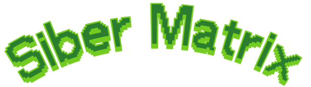
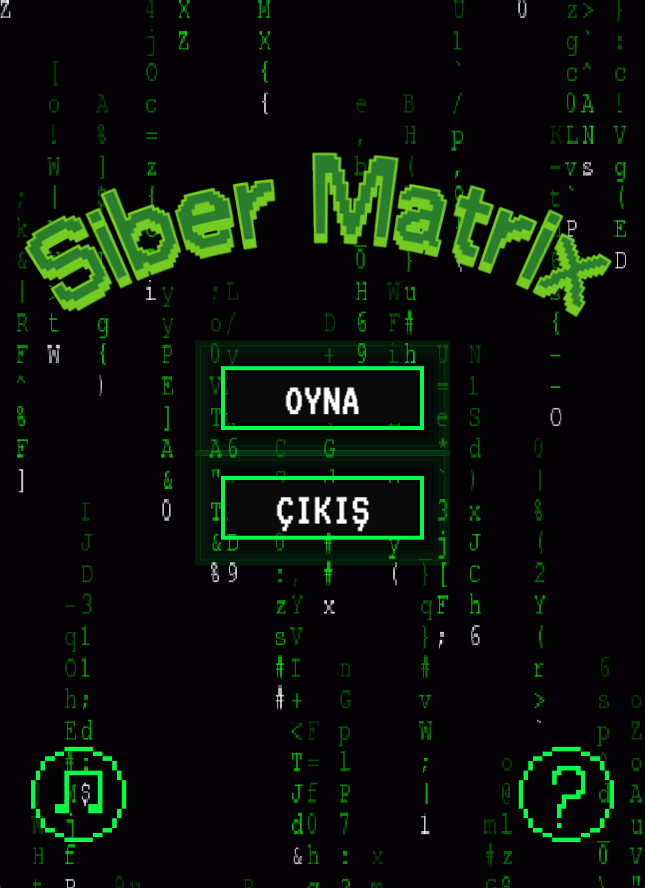
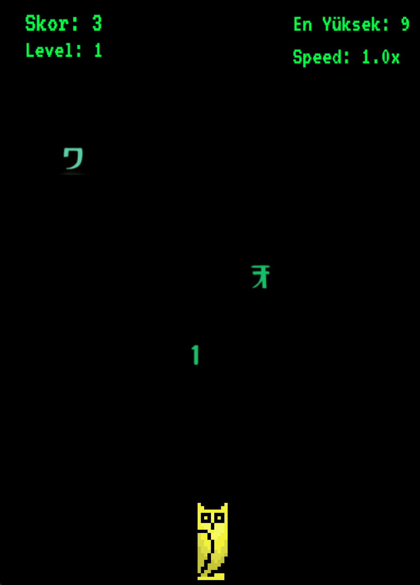
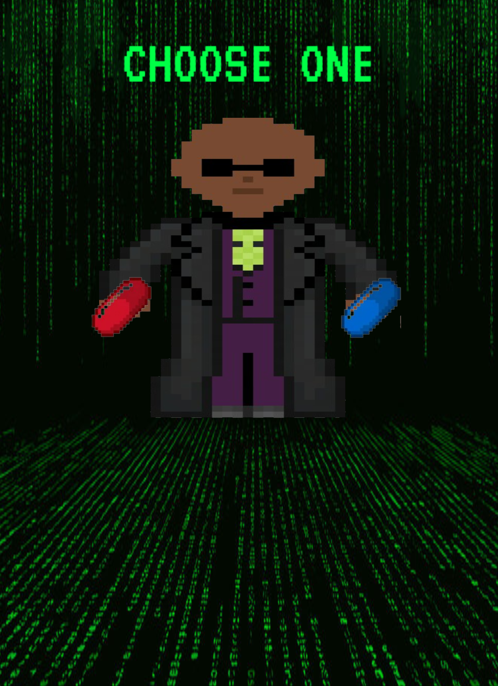
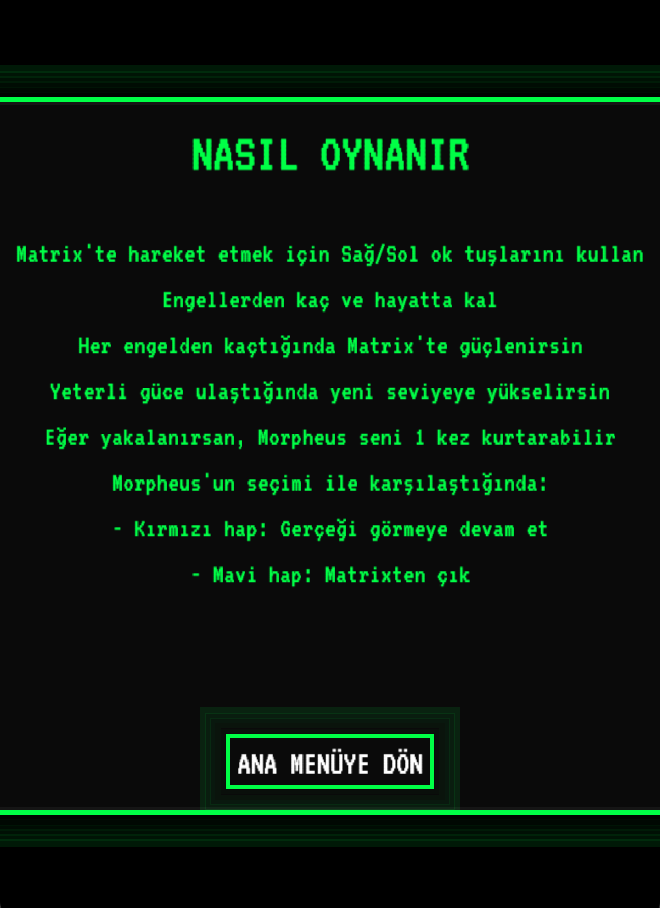
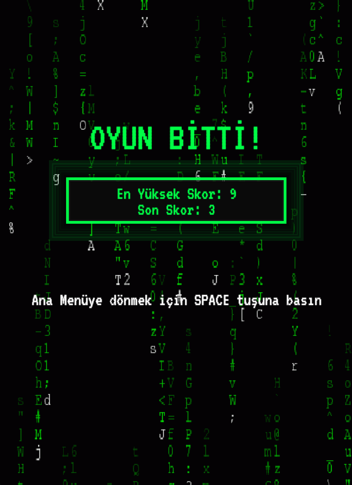
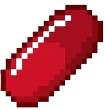
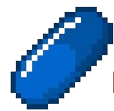

# Programlama Dilleri Laboratuvarı Projesi - Siber Matrix
---

<div style="display: flex; justify-content: center; margin: 20px 0;">
  
</div>

---
> **Not:** Oyundaki tüm sprite'lar kendimizin olup hazır sprite'lar kullanılmamıştır.

## Oyun Hakkında

***Siber Matrix***, Matrix filminden esinlenilmiş, Python ve Arcade kütüphanesi kullanılarak geliştirilmiş 2D bir kaçış oyunudur. Oyuncu, düşen engellerden kaçınarak yüksek skor yapmaya çalışır. Oyun, Matrix evreninin ikonik yeşil kod yağmuru arka planı ve temalarıyla süslenmiştir.

## 🎮 Oyun Özellikleri

- **Zorluk Sistemi**
  - Oyun ilerledikçe artan zorluk seviyeleri
  - Süreye bağlı olarak hızlanan oynanış
  - Rastgele oluşturulan engel desenleri

- **Görsel ve Ses**
  - Matrix temalı retro-fütüristik arayüz
  - Orijinal Matrix müzikleri ve efektleri
  - Özel karakter ve engel tasarımları

- **Oyun İçi Özellikler**
  - Anlık skor ve en yüksek skor takibi
  - Oyun içi yardım menüsü
  - Kolay öğrenilen, ustalaşması zor oynanış
  - Oyunu duraklatma ve devam ettirme

- **Kullanıcı Deneyimi**
  - Basit ve etkili kontroller
  - Duyarlı karakter hareketleri
  - Net ve anlaşılır arayüz

---

## 🖼️ Oyun Görselleri

<style>
  @font-face {
    font-family: 'VT323';
    src: url('assets/VT323-Regular.ttf') format('truetype');
    font-weight: normal;
    font-style: normal;
  }
  .caption-text {
    font-family: 'VT323', 'Courier New', monospace;
    letter-spacing: 1px;
  }
</style>

<div style="display: grid; grid-template-columns: repeat(auto-fit, minmax(300px, 1fr)); gap: 20px; margin: 20px 0;">

<div style="border-radius: 8px; overflow: hidden; box-shadow: 0 4px 8px rgba(0,255,70,0.2); background: #0a0a0a; border: 1px solid #1a3b1a;">
  
  <div style="background: #0a1a0a; padding: 12px; text-align: center; color: #00ff46; font-weight: bold; font-size: 1.1em; letter-spacing: 1px; text-shadow: 0 0 5px rgba(0,255,70,0.3);">
    ANA MENÜ
  </div>
</div>

<div style="border-radius: 8px; overflow: hidden; box-shadow: 0 4px 8px rgba(0,255,70,0.2); background: #0a0a0a; border: 1px solid #1a3b1a;">
  
  <div style="background: #0a1a0a; padding: 12px; text-align: center; color: #00ff46; font-weight: bold; font-size: 1.1em; letter-spacing: 1px; text-shadow: 0 0 5px rgba(0,255,70,0.3);">
    OYUN İÇİ GÖRÜNÜM
  </div>
</div>

<div style="border-radius: 8px; overflow: hidden; box-shadow: 0 4px 8px rgba(0,255,70,0.2); background: #0a0a0a; border: 1px solid #1a3b1a;">
  
  <div style="background: #0a1a0a; padding: 12px; text-align: center; color: #00ff46; font-weight: bold; font-size: 1.1em; letter-spacing: 1px; text-shadow: 0 0 5px rgba(0,255,70,0.3);">
    MORPHEUS KARŞILAŞMASI
  </div>
</div>

<div style="border-radius: 8px; overflow: hidden; box-shadow: 0 4px 8px rgba(0,255,70,0.2); background: #0a0a0a; border: 1px solid #1a3b1a;">
  
  <div style="background: #0a1a0a; padding: 12px; text-align: center; color: #00ff46; font-weight: bold; font-size: 1.1em; letter-spacing: 1px; text-shadow: 0 0 5px rgba(0,255,70,0.3);">
    OYUN KILAVUZU
  </div>
</div>

<div style="border-radius: 8px; overflow: hidden; box-shadow: 0 4px 8px rgba(0,255,70,0.2); background: #0a0a0a; border: 1px solid #1a3b1a;">
  
  <div style="background: #0a1a0a; padding: 12px; text-align: center; color: #00ff46; font-weight: bold; font-size: 1.1em; letter-spacing: 1px; text-shadow: 0 0 5px rgba(0,255,70,0.3);">
    OYUN SONU EKRANI
  </div>
</div>

</div>

<div style="text-align: center; margin: 25px 0; font-style: italic; color: #4a8; font-size: 1em;" class="caption-text">
  🖥️ Oyun içi görseller yüksek kalitede Matrix temalı grafikler içerir
</div>

---

## 🎮 Nasıl Oynanır ?

### 🚀 Başlangıç
- Ana menüden __"OYNA"__ butonuna tıklayarak oyunu başlatın
- İstersen arkaplan müziğini açıp kapatabilirsin
- Oyuna başlamadan önce nasıl oynanır bilgisi için __"Nasıl Oynanır"__ butonuna tıklayabilirsin

### 🎯 Oyunun Amacı
- Düşen engellerden kaçınarak mümkün olduğunca uzun süre hayatta kalmak
- Yüksek skor yaparak en iyi skorunuzu kırmak
- Farklı zorluk seviyelerinde başarılı olmak

### 🎮 Kontroller
| Tuş | İşlev |
|------|--------|
| ⬅️ Sol Ok | Karakteri sola hareket ettirir |
| ➡️ Sağ Ok | Karakteri sağa hareket ettirir |
| ⏯️ ESC | Oyunu duraklatır/devam ettirir |
| ❌ Q | Oyunu kapatır |


### 🏆 Zorluk Sistemi
- Oyunda her seviye arttıkça oyun hızlanır
- Her seviyeyi geçmek için farklı zorluk !!
- En yüksek skorunuz kaydedilir ve bir sonraki oyununuzda görüntülenir.

## 🎭 Karakterler ve Öğeler

### 🦉 Ana Karakter - PauSiber Baykuşu
- Oyunun ana karakteri olan PauSiber'in ihtişamlı baykuşu
- Düşen engellerden kaçınmak için sola ve sağa hareket eder
- Hızlı reflekslerle en yüksek skora ulaşmaya çalışır

### 💊 Seçim Hapı
| Hap | Etkisi | Sonuç | Görünüm |
|-----|--------|--------|---------|
| 🔴 Kırmızı Hap | Mücadeleye devam etme seçeneği | Oyun içinde kalıp savaşmaya devam edersin |  |
| 🔵 Mavi Hap | Gerçeği görme seçeneği | Oyunu bırakıp ana menüye döner |  |


> **Not:** Matrix'te olduğu gibi, mavi hap seni güvenli bir yere götürürken, kırmızı hap gerçekleri görmeni ve mücadeleye devam etmeni sağlar.

### ⚠️ Engeller
Oyun boyunca karşılaşacağınız 9 farklı engel bulunmaktadır. Her engelin boyutu ve puan değeri farklıdır. Engellerden kaçınarak hayatta kalmaya çalışın!

---

## ⚙️ Kurulum Rehberi

### 1. Python'un Kurulumu
1. [Python'un resmi web sitesini](https://www.python.org/downloads/) ziyaret edin
2. İşletim sisteminize uygun olan en son Python sürümünü indirin
3. Kurulum sırasında **"Add Python to PATH"** seçeneğini işaretlediğinizden emin olun

### 2. Gerekli Kütüphanelerin Yüklenmesi
Terminal veya komut istemini açıp aşağıdaki komutları çalıştırın:

```bash
# Arcade kütüphanesini yükleme
pip install arcade==2.6.12

# GIF hareketleri için gerekli kütüphaneler
pip install pillow==9.5.0

# Oyunun çalışması için gerekli diğer bağımlılıklar
pip install pyglet==2.0.10
```

### 3. Oyunu İndirme ve Çalıştırma

#### Windows Kullanıcıları İçin:

1. **[İndir](https://github.com/mlihgenel/siber-matrix/archive/refs/heads/main.zip)** butonuna tıklayarak oyunu indirin
2. İndirilen `siber-matrix-main.zip` dosyasına sağ tıklayıp "Tümünü çıkar..." seçeneğini seçin
3. Açılan klasörde `main.py` dosyasına çift tıklayın

Eğer çalışmazsa:
1. `main.py` dosyasına sağ tıklayın
2. "Birlikte Aç" > "Python" seçeneğini seçin

Veya komut istemcisi (CMD) ile:
```
git clone https://github.com/kullaniciadi/siber-matrix.git
cd siber-matrix
python main.py
```

#### macOS/Linux Kullanıcıları İçin:
```bash
# Projeyi klonlama
git clone https://github.com/kullaniciadi/siber-matrix.git

# Klasöre geçiş yapma
cd siber-matrix

# Oyunu başlatma
python3 main.py
```

## 👥 Geliştirici Ekibi

| Ad Soyad | E-posta |
|----------|---------|
| Ahmet Melih Genel  | [mlihgenel@gmail.com](mailto:mlihgenel@gmail.com)
| Mehmet Mert Kırgıl | [kirgilmert@gmail.com](mailto:kirgilmert@gmail.com)

